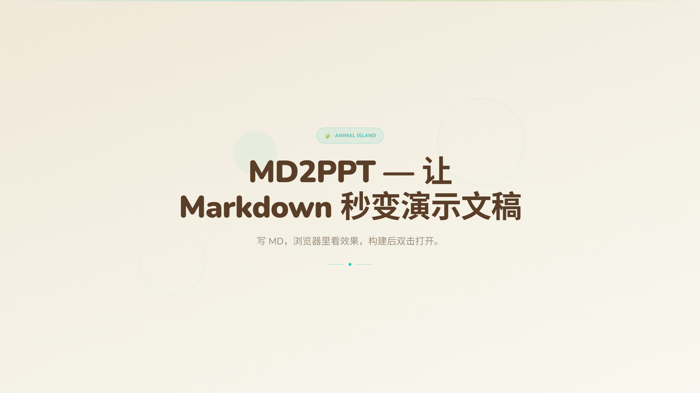
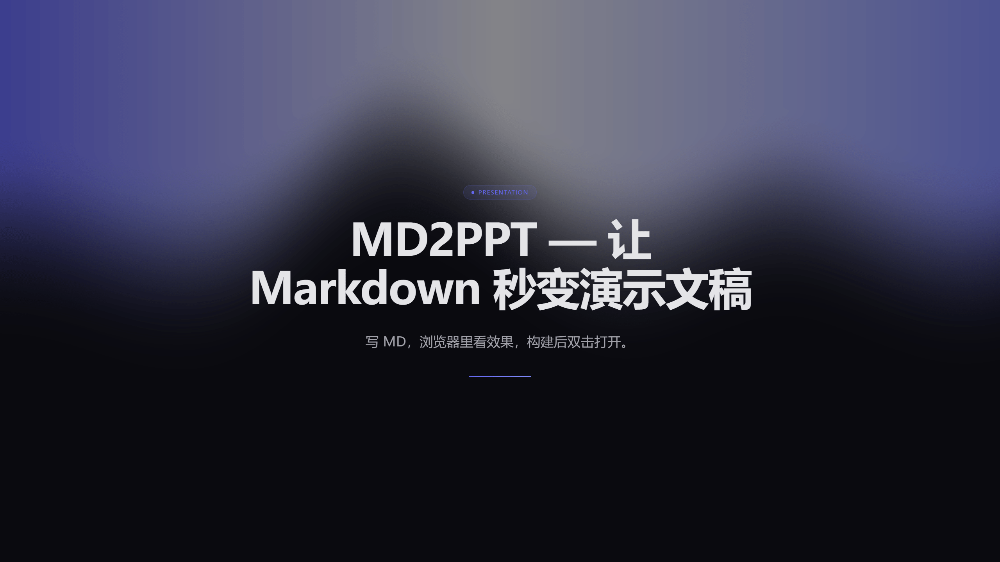
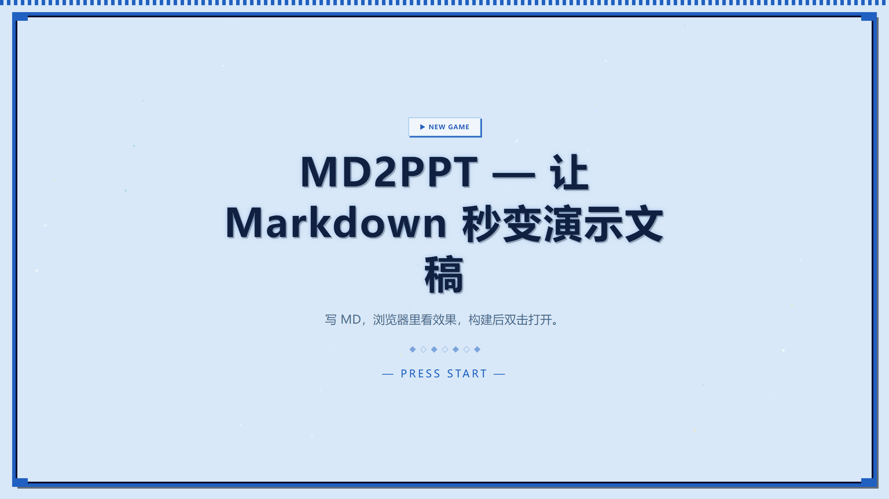

<p align="center">
  
</p>

<h1 align="center">MD2PPT</h1>
<p align="center">Markdown → Horizontal Swipe Web Slides</p>

<p align="center">
  
  
  
</p>

<p align="center">
  🌐 <a href="./README.md">中文版本</a>
</p>

---

## What is MD2PPT

**MD2PPT** turns Markdown into swipeable web-based presentation slides. Write MD, preview in browser, double-click to open the built output.

**Core feature**: Built-in `/md2ppt` AI skill — paste your speech script, AI distills key points and generates layout-tagged PPT slides. Slides are visual anchors, not teleprompters.

## AI-Generated PPT (Recommended)

```
Your speech → AI (/md2ppt) → tagged MD → live preview
```

### Step 1: Write a speech script

Plain Markdown, no layout tags needed:

```markdown
# My Talk Title

## Opening

Hello everyone, today I'll cover...

## Key Metrics

80% user growth, revenue doubled...
```

### Step 2: AI generates slides

Type `/md2ppt` in Claude Code and paste your script. The AI:

- 🔍 Analyzes content structure
- ✂️ **Distills**: long sentences → short phrases, paragraphs → keywords
- 🏷️ Adds `{layout: xxx}` tags
- 📝 Outputs `xxx-ppt.md`

### Step 3: Preview

```bash
npm run dev
```

Open `http://localhost:5173`, use arrow keys to navigate.

## Quick Start

```bash
npm install
npm run dev        # dev → http://localhost:5173
npm run build      # build to dist/
npm run preview    # preview build output
```

## Distributable Output

### Option A: Continue editing → Launch local server

| Platform | How to launch | Requirement |
|----------|--------------|-------------|
| **Windows** | Double-click `dist/start.bat` | PowerShell (built-in) |
| **macOS** | Double-click `dist/start.command` | Perl (built-in) |
| **Linux** | Run `bash dist/start.sh` | Perl (built-in) |

> All single-file, zero dependencies. `start.bat` embeds a PowerShell server; `start.command` / `start.sh` embed a Perl server.

> The build auto-selects the script for the current platform. To ship cross-platform, manually copy other scripts from `scripts/`.

```
dist/
├── start.bat / .command / .sh  ← platform-specific launcher (single-file, embedded server)
├── slides-ppt.md               ← edit this
└── assets/
    ├── index.html
    └── favicon.png
```

1. Double-click the script for your platform → browser opens automatically
2. Edit `dist/slides-ppt.md` and save → auto-refresh within 500ms
3. Close the terminal → server stops

> 💡 The page polls `slides-ppt.md` every 500ms for changes.

### Option B: Content finalized → HTML only

The HTML file embeds the MD content at build time. **No server, no MD file needed**.

Double-click `index.html` to present fullscreen.

## Configuration

Edit `.env`:

```env
VITE_MD_FILE_PATH=md/slides-ppt.md
VITE_ASSETS_PATH=md/assets
```

## Slide Splitting

| Trigger | Effect |
|---------|--------|
| `#` / `##` / `###` / `####` headings | Each heading becomes a slide |
| `---` horizontal rule | **Global page break** |
| `<video>` / `` tags | Extracted as full-screen slide |
| ` ``` ` code blocks | Protected from splitting |

## Layouts (28 types)

Add `{layout: xxx}` after headings, with optional `{anim: xxx}` for GSAP animations:

| Category | Layouts | Use |
|----------|---------|-----|
| **Cover** | `cover` `cover-split` `cover-minimal` | Standard / split-screen / minimal |
| **Section** | `section` `section-icon` `section-number` | Card / icon / numbered |
| **Content** | `content` `content-centered` `content-cards` | Standard / centered / card wrap |
| **Two-Col** | `two-column` `two-top-bottom` `two-asymmetric` | Side-by-side / stacked / ratio |
| **Stats** | `stats` `stats-grid` `stats-inline` | Single / grid / inline |
| **Quote** | `quote` `quote-large` | Standard / fullscreen |
| **Code** | `code-full` | Full-screen code highlight |
| **Comparison** | `comparison` `comparison-cards` | Binary / card style |
| **Timeline** | `timeline` `timeline-horizontal` | Vertical / horizontal |
| **List** | `list` `list-numbered` `list-checklist` | Icon / numbered / checklist |
| **Media** | `media-hero` `media-grid` | Full bleed / image grid |

## Animations (20 presets)

| Type | Presets |
|------|---------|
| **Entry** | `fade-in` `fade-in-up/down/left/right` `slide-in-up/left/right` `zoom-in` `zoom-out` `bounce-in` `flip-in-x/y` |
| **Stagger** | `stagger-fade-up/left/right` `stagger-scale` `stagger-bounce` |
| **Exit** | `fade-out` `slide-out-left` |

## Kit Themes (7 Kits)

Tap to cycle, long-press for popup panel. 6 color themes per kit:

| Kit | Style | Source |
|-----|-------|--------|
| **Realtime Beats** | Modern tech, WebGL backgrounds, glassmorphism | [GitHub](https://github.com/anggiedimasta/ui) |
| **Animal Island** | Natural warm, rounded cards | [GitHub](https://github.com/guokaigdg/animal-island-vue) |
| **Holo Sci-Fi** | Holographic, neon colors, hexagonal geometry | [GitHub](https://github.com/OviOvocny/Holo) |
| **Pixel Island** | Retro pixel game, Pokémon / Stardew aesthetic | [GitHub](https://github.com/shika-works/pixelium-design) |
| **Water Ink** | Chinese ink painting, rice paper texture, vertical text | [GitHub](https://github.com/shuimo-design/shuimo-ui) |
| **Cyberpunk 2077** | Cyberpunk, terminal HUD, neon night | [GitHub](https://github.com/xuanseus/md2ppt) |
| **Pixel Retro** | 8-bit NES aesthetic, pixel-precise borders | [GitHub](https://github.com/maomentai817/pixel-ui) |

6 color themes per kit. Add kits: create folder under `src/kits/` → `index.ts` → register in `kits/index.ts`.

### Kit Preview

| Animal Island | Realtime Beats | Pixel Island |
|:---:|:---:|:---:|
|  |  |  |
| Natural Warm | Modern Tech | Retro Pixel Game |

## Shortcuts

| Key | Action |
|-----|--------|
| `←` `→` Space PageUp/Down | Navigate |
| Home / End | First / last slide |
| Tab | Slide overview |
| F | Toggle fullscreen |
| Number keys | Jump to slide |
| P | Auto-play |
| K / T / A / S | Kit / Theme / Transition / Scale |
| Mouse wheel / touch swipe | Navigate |

## Dock Controls

- Navigation / Fullscreen / Overview / **Auto-play (3s)** / Kit / Theme / Transition / Scale
- Auto-hide after 1s of inactivity; reappears when the mouse enters the Dock area at the bottom (both fullscreen and windowed)
- Kit/theme/transition/scale: tap to cycle, **long-press for swipe-select popup**
- 7 transitions: slide / fade / zoom / flip / pixel / reveal / none
- 3 scale levels: 1x / 1.25x / 1.5x

## Tech Stack

- **Vue 3** Composition API `<script setup>` + **TypeScript**
- **Vite** + **Tailwind CSS v4**
- **marked** + **shiki** — MD parsing & Dracula syntax highlighting
- **Custom Vite plugin** — `virtual:slides` + HMR
- **unplugin-auto-import / unplugin-vue-components**
- **vite-plugin-singlefile** — single-file output

---

<p align="center">MIT</p>
